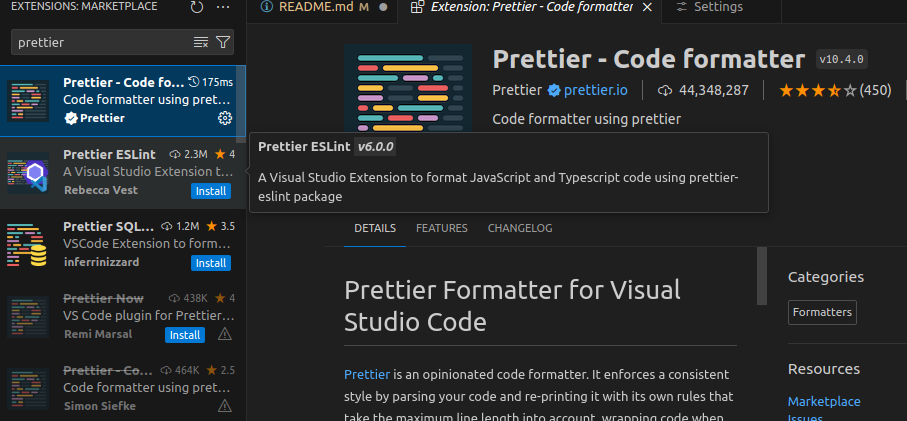
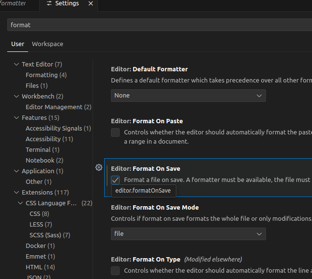

# simple-todo-react-app
A simple TODO-APP developt in React


## Prequisites
* Node 18 or above
* React 18 or above
* Vite
* TypeScript

## Functional Requirements
* list todos
* create a todo
* delete a todo
* mark todo as done
* move todo up
* move todo down

## Commands
```shell
npm install
npm run dev
```

# Tasks

## Task #1 - create a ToDoList Compnent
* create a ToDoList Compnent
  * Functions:
    * add todo
    * delete todo
    * move todo up
    * move todo down
  * Styling
    * add css

## Task #2 - create a github-action to deploy app
* ☑️ create a github-action to publish the app on a github-page

## VSCode Plugins

### Prettier
Install Prettier


##### Configure Prettier
